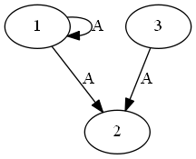
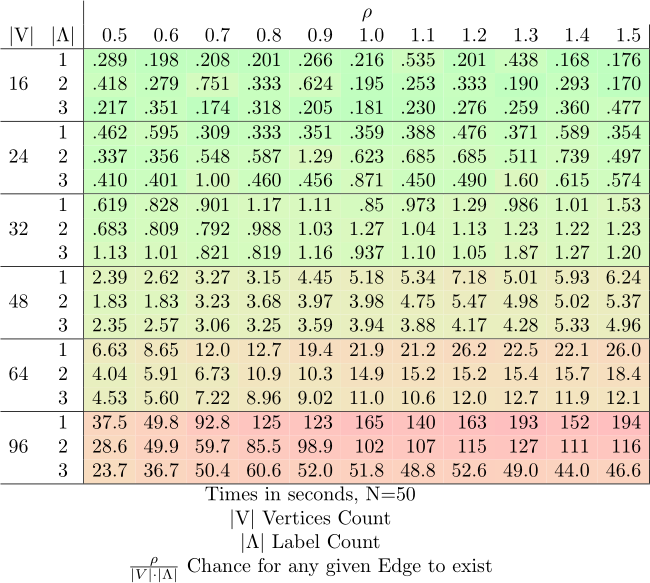

# CoReS
Computation of  Retracts encoded as SMT/SAT

## Install:

To use CoReS without the GUI you need to install the following prerequisites:

z3py:  
[Install as per their instructions, including the environmental variables.](https://github.com/Z3Prover/z3/wiki/Using-Z3Py-on-Windows)  
graphviz (as in the Graphviz to Python interface):  
[Install as per their instructions, including underlying actual Graphviz Software.](https://github.com/xflr6/graphviz)  
Graphviz:  
As detailed above

If you want to use the GUI as well, you need an up to date PIL fork, [such as Pillow](https://pypi.python.org/pypi/Pillow/5.0.0):  
```pip install pillow```

## GUI:

GUI mode's primary use is so simplify the interpretation and comparison of single graphs and their cores.
You can load and save Graphs, as well as generate new ones or write your own in the textfield.
Saving and starting a search for the core renders the current Graph in the textfield, but you can also manually trigger a re-Render with the Render button or Ctrl-r.
To search for the core, use the Get Core button or Ctrl-c. Alternativly you can use Ctrl-z to try and find a core with the SMT-based z3py approach, but there is currently no know practical usecase for that.
Afterwards you can compare the core with the original graph, save your core-graph or further alter the core-graph and iterate.

## CLI:

More usefull for batch work, or embedding this tool into other work is the CLI mode.

To create a Graph, you can copy another one with:  
```new_graph = cores.Graph(graph=old_graph.graph)  ```  
Generate one with:  
```graph = cores.Graph(gen=(x,y,z))  ```  
where x is the amount of nodes, y the amount of labels and z the average amount of outgoing edges per node.  

Most importantly you can parse one with:  
```graph = cores.Graph(parse=file_path)```  
where file_path is the string of a file path to a graph in plaintext in the following format:  
First line is a list of single-space separated integers which represent, and are namegiving for, the nodes of the graph.  
All following lines consist of a single integer representing the source node of an edge, followed by a space and another integer representing the target node, followed by a space and a single capital Latin letter denominating the lable of the given edge.  
I.e.:
```
1 2 3 
1 1 A
1 2 A
3 2 A
```
for the graph:  
  

Following that you can search for the core graph with:  
```graph.solve()```  
and subsequently generate an image of the core, or save it as a txt in the aforementioned format with:  
```
graph.visualize(picture_path)
graph.serialize(text_path)
```

## Benchmark:

For a small sense of performance, we have the following Benchmark showing performance on randomly generated graphs:  
  
