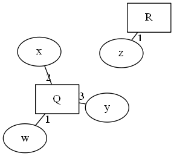

# CoReS
Computation of  Retracts encoded as SMT/SAT

## Installation:

To use CoReS without the GUI you need to install the following prerequisites:

limboole:  
Download from http://fmv.jku.at/limboole/ and setup an according PATH for limboole  
z3py:  
[Install as per their instructions, including the environmental variables.](https://github.com/Z3Prover/z3/wiki/Using-Z3Py-on-Windows)  
graphviz (as in the Graphviz to Python interface):  
[Install as per their instructions, including underlying actual Graphviz Software.](https://github.com/xflr6/graphviz)  
scipy:  
```pip install scipy```

If you want to use the GUI as well, you need an up to date PIL fork, [such as Pillow](https://pypi.python.org/pypi/Pillow/5.0.0):  
```pip install pillow```

## GUI:

GUI mode's primary use is to simplify the interpretation and comparison of single graphs and their cores.
Before rendering, loading, calculating the core of a Graph etc, you need to specify whether you are working on a directed Graph (Graph) or Hypergraph (HGraph) via the radiobuttons.
You can load and save Graphs, as well as generate new ones or write your own in the textfield.
Saving and starting a search for the core renders the current Graph in the textfield, but you can also manually trigger a re-Render with the Render button or Ctrl-r.
To search for the core, use the Get Core button or Ctrl-c. Alternatively you can use Ctrl-Shift-c to try and find a core with the SMT-based z3py approach.
Afterwards you can compare the core with the original graph, save your core-graph or further alter the core-graph and iterate.

## CLI:

For batch work or embedding this tool into other work you can use the command-line interface.

### Directed Graphs:
For directed graphs you'll be using cores.Graph.

To create a Graph, you can copy another one with:  
```h = cores.Graph(copy=g)  ```  
Generate one with:  
```g = cores.Graph(gen=(x,y,z))  ```  
where x is the amount of nodes, y the amount of labels and z the expected value of the average amount of edges per node.  

Most importantly you can parse one with:  
```graph = cores.Graph(parse=file_path)```  
where file_path is the string of a file path to a graph in plaintext in the following format:  
First line is a list of space separated integers which name the nodes of the graph.  
All following lines consist of a single integer representing the source node of an edge, followed by a space and another integer representing the target node, followed by a space and a single capital letter denominating the lable of the given edge. I.e.:
```
1 2 3 
1 1 A
1 2 A
3 2 A
```
for the graph:  


### Hypergraphs:
For directed graphs you'll be using coresh.HGraph, the mode of operation remaining mostly the same as with directed Graphs:  
```h = coresh.HGraph(copy=g)  ```  
Generating a graph adds a fourth parameter:  
```g = coresh.HGraph(gen=(x,y,w,z))  ```  
where x is the amount of nodes, y the amount of labels, w the expected value of the average arrity of the labels and z the expected value of the average amount of connections to edges per node divided by two.  
```graph = coresh.HGraph(parse=file_path)```  
where file_path is the string of a file path to a hypergraph in plaintext in the following format:  
Sections describing Nodes, Labels and Edges are marked by ```V:```, ```L:``` and ```E:``` respectively and in that order, followed by a newline.  
The only line after ```V:``` is a list of space separated terms of regex ```[a-z0-9_.]+``` which name the nodes of the graph.  
All lines after ```L:``` consist of a string of capital letters followed by an integer which describe the name and arrity of all labels.  
All lines after ```E:``` consist of a string of capital letters followed by a list of space separated terms of regex ```[a-z0-9_.]+``` which describe the label and attached nodes in order of all edges.
I.e.:
```
V:
w x y z
L:
P 2
Q 3
R 1
E:
Q w x y
R z
```
for the graph:  


### Calculating Cores:

Once you have a Graph or HGraph object, you can calculate it's core:
```
g.solve()   #SAT based approach
g.z3solve() #SMT based approach
``` 
### Visualizing and Serializing:
To visualize or serialize any directed Graph or Hypergraph, core graph or not, you can use:
```
g.visualize(picture_path)
g.serialize(text_path)
```
You can also leave the paths blank, to save the image/text under:
```
/graphs/[time-based].txt
/hgraphs/[time-based].txt
/images/[time-based].png
/himages/[time-based].png
```
